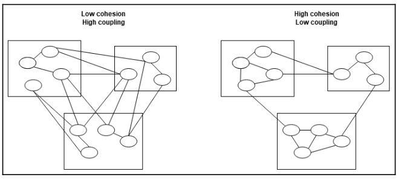

## Coupling and cohesion
* Coupling and cohesion are two terms that go hand in hand in software.

</br>

### Coupling
* Coupling is a measure of how strongly one software unit depends o ohter units.
* A unit with high coupling relies on many other unuts.
* __The lower the coupling, the better.__

</br>

* For example, if a class depends on private members of another class, it means they're tightly coupled.
* A chaned in the second class would probably mean that the first one needs to be changed as well, which is why it's not a desirable situation.

</br>

* To weaken the coupling in the preceding scenario, we could think about adding parameters for the member functions instead of directly accessing ohter classes' private members.

</br>

* Another example of tightly coupled classes is the first implementation of the `Project` and developer classes in the dependency inversion section. Let's see what would happen if we were to add yet another developer type:

</br>

``` c++
class MiddlewareDeveloper{

public:
    void developMiddleware() {}
};

class Project{

public:
    void deliver() {
        fed_.developFrontEnd();
        med_.developMiddleware();
        bed_.developBackEnd();
    }
private:
    FrontEndDeveloper fed_;
    MiddlewareDeveloper med_;
    BackEndDeveloper bed_;
}
```

</br>

* It looks like instead of just adding the `MiddlewareDeveloper` class, we had to modify the public interface of the `Project` class.
* This means they're tightly coupled and that this implementation of the `Project` class actually breaks the OCP.
* For comparison, let's now see how the same modification would be applied to the implementation using dependency inversion: 

</br>

``` c++
class MiddlewareDeveloper{
public:
    void develop() { developMiddleware(); }
private:
    void developMiddleware();
};
```

</br>

* No changes to the `Project` class were required, so now the classes are loosely coupled.
* All we needed to do was to add the `MiddlewareDeveloper` class. Structuring our code this way allows for smaller rebuilds, faster development, and easier testing, all with less code that's easier to maintain.
* To use our new class, we only need to modify the calling code:

</br>

``` c++
using MyProject = Project<FrontEndDeveloper, MiddlewareDeveloper, BackEndDeveloper>;
auto alice  = FrontEndDeveloper{};
auto charlie = MiddlewareDeveloper{};
auto bob = BackEndDeveloper{};
auto new_project = MyProject{{alice, charlie, bob}};

new_project.deliver();
```

</br>

* This shows coupling on a class level. On a larger scale, for instance, between services, the low coupling can be achieved by introducing techniques such as message queueing.
* The services wouldn't then depend on each other directly, but just on the message format.
* If you're having a microservice architecture, a common mistake is to have multiple services use the same database. This cause coupling between those services as you cannont freely modify the database schema without affecting all the microservices that use it.

</br>

### Cohesion
* Cohesion is a measure of how strongly a software unit's elements are related.
* In a highly cohesive system, the functionality offered by components in the same module is strongly related. It feels like such components just belong together.

</br>

* On a class level, the more fields a method manipulates, the more cohesive it is to the class. This means that the most commonly spotted low-cohesion data types are those big monolithic ones.
* When there's too much going on in a class, it most probably is not cohesive and breaks the SRP, too. This makes such classes hard to maintain and bug-prone.

</br>

* Smaller classes can be incohesive as well. Consider the following example. It may seem trivial, but posting real-life scenarios, often hundreds if not thousands of lines long, would be impractical:

</br>

``` c++
class CachingProcessor{
public:
    Result process(WorkItem work);
    Results ProcessBatch(WorkBatch batch);
    void addListener(const Listener &listener);
    void removeListener(const Listener &listener);
private:
    void addToCache(const WorkItem &work, const Result &result);
    void findInCache(const WorkItem &work);
    void limitCacheSize(std::size_t size);
    void notifyListeners(const Result &result);
    // ...
};
```

</br>

* We can see that our processor actually does three types of work: the actual work, the caching of the results, and managing listeners.
* A common way to increase cohesion in such scenarios is to extract a class or even multiple ones:

</br>

``` c++
class WorkResultCache{
public:
    void addToCache(const WorkItem &work, const Result &result);
    void findInCache(const WorkItem &work);
    void limitCacheSzie(std::size_t size);
private:
    //...
};

class ResultNotifier{
public:
    void addListener(const Listener &listener);
    void removeListener(const Listener &listener);
    void notify(const Result &result);
private:
    // ...
};

class CachingProcessor{
public:
    explicit CachingProcessor(ResultNotifier &notifier);
    Result process(WorkItem work);
    Results processBatch(WorkBatch batch);
private:
    WorkResultsCache cache_;
    ResultNotifier notifier_;
    //...
};
```

</br>

* Now each part is done by a seperate, cohesive entity. Reusing them is now possible without much hassle.
* Even making them a template class should require little work. Last but not least, testing such classes should be easier as well.

</br>

* Putting this on a component or system level is straightforward - each component, service, and system you design should be concise and focus on doing thing and doing it right:

</br>



</br>

* Low cohesion and high coupling are usually associated with software that's difficult to test, reuse, maintain, or even understand, so it lacks many of the quality attributes usually desired to have in software.

</br>

* Those terms often go together because often one trait influences the other, regardless of whether the unit we talk about is a function, class, library, service, or even a whole system.

* To give an example, usually, monoliths are highly coupled and low cohesive, while distributed services tend to be at the other end of the spectrum.

</br>

### reference: Software Architecture with C++: Design modern systems using effective architecture concepts, design patterns, and techniques with C++20