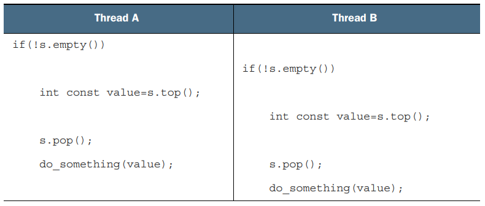

### Spotting race conditions inherent in interfaces
* Just because you're using a mutex or other mechanism to protect shared data, it doesn't mean you're protected from race conditions.
    * You still have to ensure that the appropriate data is protected.
* Consider a data structure like the _std::stack_ container adapter shown in below example.
    * Aside from the constructors and _swap()_, there are only five things you can do to a _std::stack_.
    * You can _push()_ a new element onto the stack, _pop()_ an element off the stack, read the _top()_ element, check whether it's _empty()_, and read the number of elements - the _size()_ of the stack.
    * If you change _top()_ so that it returns a copy rather than a reference and protect the internal data with mutex, this interface is still inherently subject to race conditions.
        * This prolbem is not unique to a mutex-based implementation; it's an interface problem, so the race conditions would still occur with a lock-free implememtation.

</br>

#### [example: 3.The interface to the std::stack container adapter](./example/ex3_interface_stack_container_adapter.cc)

</br>

* The problem here is that the results of _empty()_ and _size()_ can't be relied on.
    * Although they might be correct at the time of the call, once they've returned, other threads are free to access the stack and might _push()_ new elments onto or _pop()_ the existing ones off of the stack before the thread that called _empty()_ or _size()_ could use that information.

```c++
stack<int> s;
if(!s.empty()){
    int const value = s.top();
    s.pop();
    do_something(value);
}
```

* Not only is it safe in single-threaded code, it's expected: calling _top()_ on an empty stack is undefined behavior.
    * With a shared _stack_ obejct, _this call sequence is no longer safe_, because there might be a call to _pop()_ from another thread that removes the last element in between the call to _empty()_ and the call to _top()._
* What's the solution? Well, this problem happens as a consequence of the design of the interface, so the solution is to change the interface.
    * What changes need to be made? In the simplest case, you could declare that _top()_ will throw an exception if there aren't any elements in the stack when it's called.
    * Though this directly addresses this issue, it makes for more cumbersome programming, because now you need to be able to catch an exception, even if the call to _empty()_ returned _false_.
* If the stack is protected by a mutex internally, only one thread can be running a stack member function at any one time, so the calls get nicely interleaved, but the calls to _do_something()_ can run concurrently.
    * One possible execution is shown in below table.

</br>

<p align="center">

</p>

</br>

* As you can see, if these are the only threads running, there's nothing in between the two calls to _top()_ to modify the stack, so both threads will see the same value.
    * Not only that, but there are no calls to _top()_ between the calls to _pop()_.
    * Consequently, one of the two values on the stack is discarded without ever having been read, whereas the other is processed twice.
    * __This is yet another race condition and far more insidious than the undefined behavior of the empty() / top() race.__
        * There's never anything obviously wrong going on, and the consequences of the bug are likely far removed from the cause, although they obvously depend on exactly what _do_somthing()_ does.
* This calls for a more radical change to the interface, one that combines the calls to _top()_ and _pop()_ under the protection of the mutex.
    * Tom Cargill pointed out that a combined call can lead to issues if the copy constructor for the objects on the stack can throw an exception.
    * This problem was dealt with fairly comprehensively from an exception-safety point of view by Herb Sutter, but the potential for race conditions brings something new to the mix.

</br>

* For those of you who aren't aware of the issue, consider _stack<vector<int>>._
* Now, a vector is a dynamically sized container, so when you copy a vector, the library has to allocate som more memory from the heap in order to copy the contents.
* If the system is heavily loaded or there are significant resource constraints, this memory allocation can fail, so the copy constructor for vector might throw a _std::bad_allc_ exception.
    * This is likely if the vector contains a lot of elements. If the _pop()_ function was defined to return the value popped, as well as remove it from the stack.
    * You have a potential problem: the value being popped is returned to the caller only _after_ the stack has been modified, but the process of copying the data to return the caller might throw an exception.
    * If this happens, the data popped is lost; it has been removed from the stack, but the copy was unsuccessful.
* The designer of the _std::stack_ interface helpfully split the operation in two: get the top element(_top()_) and then remove it from the stack(_pop()_).

</br>

#### Option 1. Pass in a reference
* The first option is to pass a reference to a variable in which you want to receive the popped value as an argument in the call to _pop()_:

``` c++
std::vector<int> result;
some_stack.pop(result);
```
* This works well for many cases, but it has the distinct disadvantage that it requires the calling code to construct an instance of the stack's value type prior to the call, in order to pass this in as the target.
* For some types this is impractical, because constructing an instance is expensive in terms of time or resources.
* For other types this isn't always possible, because the constructors require parameters that aren't necessarily available at this point in the code.
* Finally, it requires that the stored type be assignable.
    * This is an important restiction: many user-defined types do not support assignment, though they may support move construction or even copy construction.

</br>

#### Option 2. Require a no-throw copy constructor or move constructor
* There's only an exception safety problem with a value-retruning _pop()_ if the return by value can throw an exception.
* Many types have copy constructors that don't throw exceptions, and with the new rvalue-reference support in the C++ standard, many more types will have a move constructor that doesn't throw excptions, even if their copy constructor does.
* One valid option is to restrict the use of your thread-safe stack to those types that can safely be returned by value without throwing an exception.
*  Altough this is safe, it's not ideal. Even though you can detect at compile time the existence of a copy or move constructor that doesn't throw an exception using the _std::is_nothrow_copy_constructible_ and _std::is_nothrow_move_constructible_ types traits, it's quite limiting.
    * There are many more user-defined types with copy constructors that can throw and don't have move constructors than there are types with copy and/or move constructors that can't throw.
    * It would be unfortunate if such types couldn't be stored in your thread-safe stack.

</br>

#### Option 3. Return a pointer to the popped item
* The third option is to return a pointer to the popped item rather than return the item by value.
* The adventage here is that pointers can be freely copied without throwing an exception, so you've avoided Cargill's exception problem.
* The disadvantage is that returning a pointer requires a means of managing the memory allocated to the object, and for simple types such as integers, the overhead of such memory management can exceed the cost of returning the type by value.
    * For any interface that uses this option, _std::shared_ptr_ would be a good choice of pointer type.
    * This can be important for optimizaiton purposes: requiring that each object in the stack be allocated separately with _new_ would impose quite an overhead compared to the original non-thread-safe version.

</br>

#### Option 4. Provide both option 1 and either option 2 or 3
* Flexibility should never be ruled out, especially in generic code. If you've chosen option 2 or 3, it's relatively easy to provide option 1 as well, and this provides users of your code the ability to choose whichever option is most appropriate for them at little additional cost.

</br>

### Example definition of a thread-safe stack
* Below exmple shows the class definition for a stack with no race conditions in the interface and that implements options 1 and 3: there are two overloads of _pop()_, one that takes a reference to a location in which to store the value and one that returns _std::shared_ptr<>_.

</br>

#### [example: 4.An outline class definition for a thread-safe stack](./example/ex4_outline_thread_safe_stack.cc)

</br>

* By pairing down the interface you allow for maximum safety; even operations on the whole stack are restricted.
* The stack itself can'y be assigned, because the assignment operation is deleted, and there's no _swap()_ function.
    * It can, however, be copied, assuming that stack elements can be copied.
* The _pop()_ fucntions throw an _empty_stack_ exception if the stack is empty, so everything still works even if the stack is modified after a call to _empty()_.
* The use of _std::sthared_ptr_ allows the stack to take care of the memory-allocation issues and avoid excessive calls to _new_ and _delete_ if desired.
* Your five stack operations have now become three: _push(), pop(), empty()_.
    * Even _empty()_ is superfluous. This simplification of the interface allows for better control over the data; you can ensure that the mutex is locked for the entierty of an operation.
* The following listing shows a simple implementation that's a wrapper around std::stack<>.

</br>

#### [example: 5.A fleshed-out class definition for a thread-safe stack](./example/ex5_fleshed_out_thread_safe_stack.cc)

</br>

* This stack implementation is _copyable_ - the copy constructor looks the mutex in the source object and then copies the internal stack.
    * You do the copy in the constructor body rather than the member initializer list in order to ensure that the mutex is held across the copy.

</br>

* As the discussion of _top()_ and _pop()_ shows, problematic race conditions in interfaces arise because of locking at too small a granularity; the protection doesn't cover the enirety of the desired operation.
* Problems with mutexes can also arise from locking at too large a granularity; the extreme situation is a single global mutex that protects all shared data.
    * In a system where there's a significant amount of shared data, this can eliminate any performance benefits of concurrency, becuase the threads are forced to run one at a time, even when they're accessing defferent bits of data.
* One issure with fine-grained locking schemes is that sometimes you need more than one mutex locked in order to protect all the data in an operation.
    * As described prviously, sometimes the right thing to do is increase the granularity of the data covered by the mutexs, so that only one mutex needs to be locked.
    * But sometimes that's undesirable, such as when the mutexs are protecting seperate instances of a class.
    * In this case, locking at the next level up would mean either leaving the locking to the user or having a single mutex that protected all instances of that class, neither of which is particulary desirable.
* If you end up having to lcok two or more mutexes for a given operation, there's another potential problem lurking in the wings: __deadlock__.
    * This is almost the opposite of a race condition: rather than two threads racing to be first, each one is waiting for the other, so neither makes any progress.